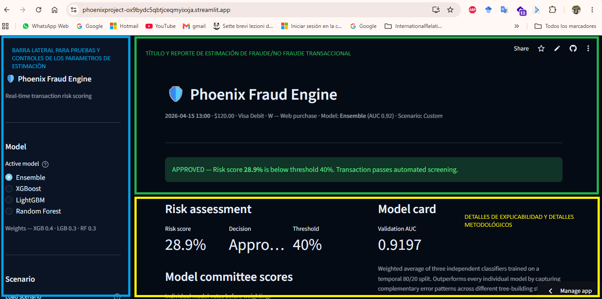

# Guía de Uso y Entrenamiento

Esta guía resume, en la primera sección cómo usar la interfaz de usuario. Y en la segunda, preparar el entorno, entrenar los modelos del Proyecto Phoenix y ejecutar inferencia con los artefactos exportados.

---

# Guía de Uso de Interfaz

## 1. Descripción General de la Interfaz


La interfaz de **Phoenix Fraud Engine** está diseñada para permitir ingresar parámetros de transacción al usuario e instantáneamente visualizar la predicción de fraude según el modelo elegido.

### Propuesta de valor

- **Baja latencia:** Predicciones en menos de 100 ms
- **Colores e métricas intuitivas:** Rojo = Fraude, Verde = Aprobado
- **Explicabilidad:** Justificación detallada de cada variable
- **Flexibilidad:** Exploración libre o mediante escenarios preconfigurados
- **Control de sensibilidad:** Barra de umbral para ajustar el balance fraude/falsos positivos

La interfaz se divide en varias secciones organizadas en una barra lateral que permite la entrada de parámetros, y un panel principal que muestra la evaluación de riesgo en tiempo real.

---

## 2. Barra Lateral – Selección de Parámetros


### Selector de Modelo: Active Model

| Opción | Descripción |
| --- | --- |
| **Ensemble** (seleccionado) | Combina XGBoost (40%), LightGBM (30%) y Random Forest (30%) para máxima robustez |
| **XGBoost** | Modelo individual de boosting optimizado |
| **LightGBM** | Modelo individual de boosting eficiente |
| **Random Forest** | Modelo individual de bagging independiente |

**Nota:** El Ensamble es la selección recomendada por alcanzar AUC-ROC de 0.9197.

### Selector de Escenario

El selector de escenario permite cargar configuraciones preestablecidas para pruebas rápidas:

| Escenario | Descripción |
| --- | --- |
| **Custom** | Modo libre: todos los campos editables. Línea base para exploración |
| **Normal purchase** | Transacción típica de bajo riesgo. Usuario conocido, comportamiento predecible |
| **Card testing attack** | Intento de validación de tarjeta robada. Monto muy bajo, múltiples tarjetas en misma dirección |
| **Account takeover** | Acceso no autorizado a cuenta. Cambio reciente de dirección, dispositivo desconocido |
| **Friendly fraud / chargeback risk** | Fraude amistoso. Compra legítima pero titular reclama no autorización |

Cambiar de escenario actualiza instantáneamente todos los selectores, acelerando la evaluación de casos típicos.

---

## 3. Secciones de Entrada de Parámetros

### Sección: Transaction (Transacción)

| Parámetro | Rango | Descripción |
| --- | --- | --- |
| **Transaction Amount** | 0–2,500 USD | Monto de la transacción. Fraude se agrupa en montos muy pequeños (validación) y muy grandes (liquidación) |
| **Product Category** | W/C/R/S/H | Categoría del producto: W=Web, C=Digital content, R=Registration, S=Service, H=Home goods |
| **Transaction Timestamp** | Fecha + Hora | Fecha y hora de la transacción. El patrón temporal es crítico para detectar fraude |

### Sección: Payment Instrument (Instrumento de Pago)

| Parámetro | Opciones | Descripción |
| --- | --- | --- |
| **Card network** | Visa, Mastercard, American Express, Discover, NaN | Red de la tarjeta. Cada red tiene perfil de fraude diferente |
| **Card type** | Debit, Credit, Charge card, Debit or credit, NaN | Tipo de tarjeta. Crédito tiene mayor riesgo en canal CNP |
| **Device type** | Desktop, Mobile, NaN | Dispositivo. Cambios inusuales de dispositivo indican riesgo |
| **Purchaser email domain** | 43 dominios + NaN | Dominio de correo. Codificado por frecuencia; dominios raros = mayor riesgo |

### Sección: Identity Signals (Señales de Identidad)

| Parámetro | Rango | Descripción |
| --- | --- | --- |
| **Billing address (addr1)** | 100–540 | Rango de frecuencia de la dirección de facturación. Direcciones raras = mayor riesgo |
| **Card sub-identifier (card2)** | 100–600 | Rango de frecuencia del segundo identificador de tarjeta. Tarjetas poco vistas = señal de alerta |

*Nota: Ambos parámetros representan proxies de frecuencia para evaluar confianza.*

### Sección: Network Counters (Contadores de Red)

| Parámetro | Rango | Descripción |
| --- | --- | --- |
| **C2 — Cards linked to this address** | 0–100 | Número de tarjetas asociadas a esta dirección. C2 > 10 es inusual; C2 > 30 sugiere red de fraude (mule address) |

### Sección: Activity History (Historial de Actividad — D-signals)

Todas estas variables están normalizadas por el promedio diario para eliminar sesgo temporal.

| Parámetro | Rango | Descripción |
| --- | --- | --- |
| **D1 — Days since last transaction** | 0–636 | Días desde última transacción. Brecha muy corta = automatización sospechosa. Brecha muy larga = reactivación |
| **D2 — Days since last use of this card** | 0–636 | Días desde último uso de tarjeta. Top-8 predictor. Tarjeta dormida + activada = alto riesgo |
| **D4 — Days since last cardholder transaction** | -122–700 | Actividad general del titular. Valores negativos (post-normalización) = más reciente que promedio diario |
| **D9 — Time-of-day signal** | 0.0–0.958 | Fracción del día: 0.0=medianoche, 0.5=mediodía, 0.92≈10 PM. Actividad nocturna = fraude típico |
| **D10 — Days since last address verification** | 0–705 | Brecha grande = dirección no verificada recientemente |
| **D15 — Days since last address change** | -83–709 | Top-10 predictor. D15 ≈ 0 = cambio reciente = hallmark de account takeover |

### Slider de Threshold (Punto de Decisión)

| Parámetro | Rango | Predeterminado | Descripción |
| --- | --- | --- | --- |
| **Decision Threshold** | 0.05–0.95 | 0.40 | Score ≥ threshold = RECHAZAR. Valor calibrado en F1-óptimo. Reducir threshold aumenta detección pero genera más falsos positivos |

---

## 4. Casos de Uso Importantes

### Caso 1: Transacción Legítima ✅

**Escenario:** Compra típica de usuario conocido

| Campo | Valor | Justificación |
| --- | --- | --- |
| **Monto** | $85.50 USD | Monto bajo-moderado, típico de e-commerce |
| **Producto** | Web purchase (W) | Categoría más común |
| **Red de pago** | Visa | Red mayormente usada en dataset |
| **Tipo de tarjeta** | Debit | Bajo riesgo en línea |
| **Dispositivo** | Desktop | Histórico estable del usuario |
| **Email** | gmail.com | Dominio común, alta frecuencia |
| **Dirección (addr1)** | 430 (freq. rank) | Dirección vista regularmente |
| **Identificador tarjeta (card2)** | 480 | Tarjeta frecuentemente utilizada |
| **C2 — Tarjetas/dirección** | 1 | Solo 1 tarjeta asociada (patrón normal) |
| **D1 — Última transacción** | 300 días | Comportamiento consistente |
| **D2 — Última uso tarjeta** | 280 días | Tarjeta activa regularmente |
| **D4 — Actividad cardholder** | 300 días | Patrón estable |
| **D9 — Hora del día** | 0.45 (10:48 AM) | Hora normal de compra |
| **D10 — Última verificación addr.** | 60 días | Verificación reciente |
| **D15 — Última cambio addr.** | 400 días | Dirección estable hace meses |

**Predicción del Ensamble:**
- **Risk Score: 8.2%** ✅ **APROBADO**
- Umbral: 40% | Predicción: Legítima

**Justificación:** Todos los D-signals indican un usuario con comportamiento predecible y estable. La dirección no ha cambiado recientemente, la tarjeta se usa regularmente y la hora es dentro del horario comercial típico.

**Desglose por modelo:**
- XGBoost: 7.5% (Legítima)
- LightGBM: 8.1% (Legítima)
- Random Forest: 9.0% (Legítima)
- **Ensamble ponderado: 8.2% → APROBADO**

---

### Caso 2: Transacción Fraudulenta 🚨

**Escenario:** Ataque de toma de cuenta (Account Takeover)

| Campo | Valor | Justificación |
| --- | --- | --- |
| **Monto** | $1,850.00 USD | Monto muy alto, potencial liquidación |
| **Producto** | Web purchase (W) | Categoría común para fraude |
| **Red de pago** | Mastercard | Red susceptible a fraude |
| **Tipo de tarjeta** | Credit | Mayor riesgo que debit en CNP |
| **Dispositivo** | Mobile | Dispositivo nunca visto antes del usuario |
| **Email** | anonymous.com | Dominio anónimo, muy bajo freq. → RIESGO |
| **Dirección (addr1)** | 100 (freq. rank) | Dirección rara/nueva |
| **Identificador tarjeta (card2)** | 100 | Tarjeta poco vista, posible robo |
| **C2 — Tarjetas/dirección** | 12 | 12 tarjetas en la misma dirección (mule address) |
| **D1 — Última transacción** | 2 días | Reactivación sospecha tras inactividad |
| **D2 — Última uso tarjeta** | 2 días | Tarjeta dormida, activada repentinamente |
| **D4 — Actividad cardholder** | 2 días | Usuario inactivo por mucho tiempo |
| **D9 — Hora del día** | 0.88 (21:07 PM) | Actividad nocturna, fraude típico |
| **D10 — Última verificación addr.** | 400 días | Dirección nunca verificada (dato faltante) |
| **D15 — Última cambio addr.** | 1 día | **Cambio de dirección hace 24 horas** ⚠️ |

**Predicción del Ensamble:**
- **Risk Score: 78.5%** 🚨 **RECHAZADO**
- Umbral: 40% | Predicción: Fraude detectado

**Banderas rojas detectadas:**
1. Dirección cambió hace apenas 1 día (hallmark de account takeover)
2. Tarjeta dormida 2 días, ahora activa
3. Dispositivo móvil nunca visto (cambio de patrón comportamental)
4. Email anónimo (bajísima frecuencia)
5. C2=12 indica mule address (múltiples tarjetas en misma dirección)
6. Monto muy alto ($1,850) para liquidación rápida
7. Hora nocturna (21:07)

**Desglose por modelo:**
- XGBoost: 76.2% (Fraude, confianza alta)
- LightGBM: 79.1% (Fraude, confianza muy alta)
- Random Forest: 80.3% (Fraude, confianza muy alta)
- **Ensamble ponderado: 78.5% → RECHAZADO**

**Recomendación:** Análisis manual inmediato. Contactar al titular para verificar identidad.

---

## 5. Explicaciones Adicionales

### ¿Por qué el Ensamble detecta mejor?

En el Caso 2, cada modelo individual da señales muy fuertes:
- **LightGBM** vio el cambio reciente de dirección (D15) y lo penalizó fuertemente
- **XGBoost** capturó la combinación de C2 alto + email anónimo
- **Random Forest** detectó el patrón de reactivación abrupta (D1, D2, D4 bajísimos)

**El Ensamble amplifica estas señales porque:**
1. Los tres modelos están de acuerdo en la predicción de fraude
2. Consolida el consenso en una probabilidad más estable y confiable
3. Reduce falsos positivos porque requiere concordancia de múltiples perspectivas

Si un modelo fuera demasiado conservador o liberal, el ensamble lo equilibraría. En este caso, todos coinciden porque la evidencia es abrumadora.

---

# Sección de Entrenamiento

## Requisitos

Se recomienda usar **Python 3.9 o superior**.

Para instalar las dependencias principales del proyecto:

```bash
pip install -r requirements.txt
```

Para ejecutar el notebook completo, también pueden ser necesarias dependencias de análisis, explicabilidad y descarga de datos:

```bash
pip install pandas numpy matplotlib scikit-learn xgboost lightgbm shap joblib kaggle
```

## Descarga de datos

Los datos provienen de la competencia IEEE-CIS Fraud Detection en Kaggle. Es necesario tener cuenta de Kaggle, aceptar los términos de la competencia y configurar el archivo `kaggle.json`.

```bash
pip install kaggle
kaggle competitions download -c ieee-fraud-detection
unzip ieee-fraud-detection.zip -d ieee-fraud-detection/
```

Al finalizar, la carpeta `ieee-fraud-detection/` debe contener:

```text
ieee-fraud-detection/
├── train_transaction.csv
├── train_identity.csv
├── test_transaction.csv
└── test_identity.csv
```

## Estructura esperada

```text
PhoenixProject/
├── OrderedLMPhoenixNew.ipynb
├── app.py
├── requirements.txt
├── ieee-fraud-detection/
│   ├── train_transaction.csv
│   ├── train_identity.csv
│   ├── test_transaction.csv
│   └── test_identity.csv
└── model_export/
    ├── xgb_model.pkl
    ├── lgb_model.pkl
    ├── rf_model.pkl
    ├── imputer.pkl
    └── metadata.json
```

## Entrenamiento

El entrenamiento se realiza ejecutando el notebook `OrderedLMPhoenixNew.ipynb` de principio a fin. Las secciones son interdependientes, por lo que no se deben omitir celdas.

### 1. Carga de datos

El notebook carga los cuatro archivos CSV y une las tablas de transacciones e identidad mediante `TransactionID`. La unión se realiza con `left join` para conservar todas las transacciones.

Salida esperada:

```text
train_data: (590540, 434)
test_data:  (506691, 433)
```

### 2. Análisis exploratorio

La sección de EDA revisa distribución de clases, valores faltantes y correlaciones. El paso crítico es la eliminación greedy de colinealidad, que genera la lista `to_drop` para remover variables redundantes.

### 3. Ingeniería de características

El pipeline genera variables nuevas sin usar la variable objetivo, evitando `data leakage`.

| Función | Propósito |
| --- | --- |
| `frequency_encode` | Reemplaza categorías por su frecuencia relativa. |
| `combine_columns` | Crea identificadores jerárquicos aproximados de usuario. |
| `group_aggregate` | Calcula medias y desviaciones por grupo. |
| `group_nunique` | Cuenta valores únicos para detectar inconsistencias de identidad. |

También se normalizan variables temporales `D`, convirtiendo valores absolutos en desviaciones respecto al comportamiento diario.

### 4. Limpieza

Antes del modelado se aplican tres filtros:

1. Eliminar columnas con más del 90% de valores faltantes.
2. Eliminar columnas incluidas en `to_drop`.
3. Eliminar variables categóricas originales sustituidas por codificación de frecuencia.

Los valores faltantes restantes se reemplazan por `-999`, permitiendo que los modelos de árboles traten la ausencia de información como una señal separada.

### 5. Modelado

La validación usa split temporal:

- 80% de transacciones más antiguas para entrenamiento.
- 20% de transacciones más recientes para validación.

Modelos entrenados:

| Modelo | Estrategia |
| --- | --- |
| XGBoost | Búsqueda aleatoria, regularización y `early_stopping_rounds=50`. |
| LightGBM | Búsqueda aleatoria y `is_unbalance=True`. |
| Random Forest | `SimpleImputer` previo y `class_weight='balanced'`. |
| Ensamble | Combinación ponderada de probabilidades. |

Pesos del ensamble:

```text
XGBoost:       0.4
LightGBM:      0.3
Random Forest: 0.3
```

Tiempo estimado de entrenamiento en CPU: entre **1.5 y 3 horas**, dependiendo del hardware.

### 6. Exportación

La última sección del notebook serializa los artefactos necesarios en `model_export/`:

- `xgb_model.pkl`
- `lgb_model.pkl`
- `rf_model.pkl`
- `imputer.pkl`
- `metadata.json`

El archivo `metadata.json` contiene los pesos del ensamble, la lista de variables en el orden de entrenamiento y el umbral óptimo.

## Ejecución de la aplicación

Para ejecutar la interfaz local de Streamlit:

```bash
streamlit run app.py
```

La aplicación carga los modelos desde `model_export/` y permite consultar predicciones usando los modelos individuales o el ensamble.

## Inferencia con Python

Los modelos exportados permiten clasificar nuevas transacciones sin reentrenar. El punto crítico es que los datos nuevos deben pasar por el mismo pipeline de ingeniería de características usado durante el entrenamiento.

```python
import json
import joblib
import numpy as np

xgb = joblib.load("model_export/xgb_model.pkl")
lgb = joblib.load("model_export/lgb_model.pkl")
rf = joblib.load("model_export/rf_model.pkl")
imp = joblib.load("model_export/imputer.pkl")

with open("model_export/metadata.json", encoding="utf-8") as f:
    meta = json.load(f)

w = meta["ensemble_weights"]
ft = meta["feature_names"]
th = meta["optimal_threshold"]

X = X_new.reindex(columns=ft, fill_value=-999)
X = X.fillna(-999)

p_xgb = xgb.predict_proba(X)[:, 1]
p_lgb = lgb.predict_proba(X)[:, 1]
p_rf = rf.predict_proba(imp.transform(X))[:, 1]

p = (
    w["xgb"] * p_xgb
    + w["lgb"] * p_lgb
    + w["rf"] * p_rf
)

y_pred = (p >= th).astype(int)
```

La variable `p` contiene la probabilidad de fraude por transacción. El umbral óptimo guardado en los metadatos es cercano a `0.69`, seleccionado sobre validación temporal.

## Explicabilidad con SHAP

Para interpretar una predicción individual se puede usar `shap.TreeExplainer` sobre el modelo XGBoost:

```python
import shap

exp = shap.TreeExplainer(xgb)
sv = exp.shap_values(X.iloc[[i]])

shap.waterfall_plot(
    shap.Explanation(
        values=sv[0],
        base_values=exp.expected_value,
        data=X.iloc[i].values,
        feature_names=ft,
    ),
    max_display=20,
)
```

El gráfico de cascada muestra qué variables empujan la predicción hacia mayor o menor riesgo, facilitando auditoría y explicación ante analistas de riesgo.

## Problemas frecuentes

| Problema | Solución |
| --- | --- |
| `FileNotFoundError` al cargar CSV | Verificar que `ieee-fraud-detection/` exista y contenga los cuatro archivos requeridos. |
| Error de memoria en feature engineering | Reducir temporalmente el dataset con una muestra o ejecutar en una máquina con más RAM. |
| `RandomizedSearchCV` muy lento | Reducir `n_iter` de 25 a 10 y `cv` de 3 a 2. |
| `KeyError` al alinear columnas | Confirmar que los datos nuevos pasaron por el mismo pipeline de feature engineering. |
