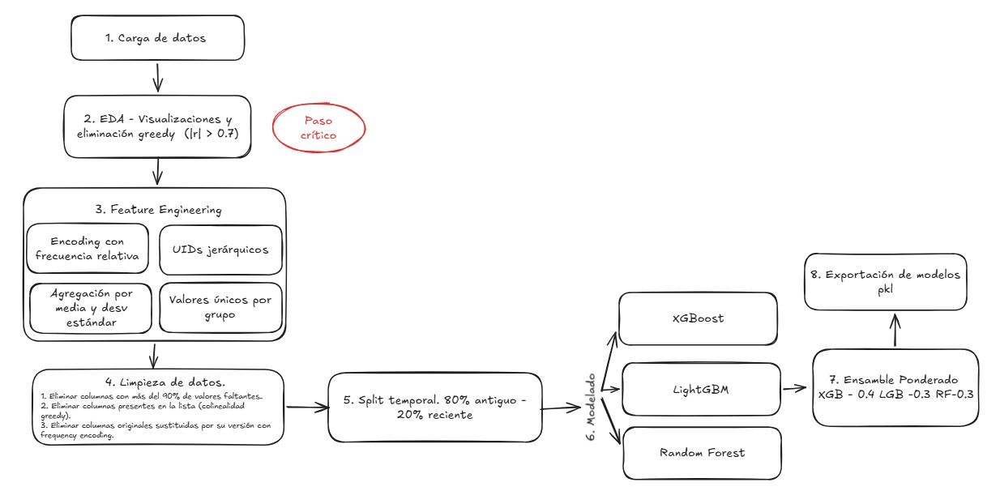

# Proyecto Phoenix: Detección de Fraude en E-Commerce
## IEEE-CIS Fraud Detection Challenge
### Grupo 2

**Equipo:** Diego Alejandro Irreño - David Fernando López - Juan Camilo López - Edda Camila Rodríguez.

**Video:** [Sustentación](https://youtu.be/N06jjvoMkDA)

**Resultado:** [Despliegue de modelos](https://phoenixproject-ox9bydc5qbtjceqmyixxja.streamlit.app/)

**Notebook:** [Notebook del proyecto](https://github.com/eddacamila/PhoenixProject/blob/main/OrderedLMPhoenixNew.ipynb)

**Guía:** [Guía de uso y entrenamiento](GUIA_USO_ENTRENAMIENTO.md)

**Origen de los datos:** [Datos Vesta Corporation](https://www.kaggle.com/competitions/ieee-fraud-detection/data)

## Objetivo

Construir un modelo predictivo de detección de fraude en transacciones de comercio electrónico utilizando técnicas de *Machine Learning*. El objetivo es identificar transacciones fraudulentas con alta precisión para proteger a comerciantes y consumidores dentro del ecosistema de pagos digitales.

## Dataset

El proyecto utiliza el conjunto de datos de la competencia **IEEE-CIS Fraud Detection**, provisto por Vesta Corporation. Es un dataset de escala industrial compuesto por dos tablas principales: **Transacciones**, con datos de pago, montos y variables anonimizadas, e **Identidad**, con información del dispositivo y red. Ambas tablas se conectan mediante `TransactionID`.

| Característica | Valor |
| --- | --- |
| Registros | 590,540 transacciones |
| Variables | 434 variables |
| Clase fraudulenta | 3.5% |
| Clase legítima | 96.5% |
| Métrica principal | AUC-ROC |

El alto desbalance de clases hace que la exactitud simple no sea una métrica confiable. Por esta razón, el modelo se evalúa principalmente con **AUC-ROC**, complementado con **precisión promedio (AP)** y **F1-score**.
## Metodología

## Resultados

El benchmarking propuesto comparó modelos supervisados eficientes para datos tabulares: **XGBoost**, **LightGBM**, **Random Forest** y un **Ensamble Ponderado Phoenix**. La validación se realizó con un split temporal, usando el 80% de las transacciones más antiguas para entrenamiento y el 20% más reciente para validación.

| Clasificador | AUC-ROC | Precisión promedio (AP) | F1-score | Umbral óptimo |
| --- | ---: | ---: | ---: | ---: |
| XGBoost Base | 0.9128 | 0.5401 | 0.5315 | 0.76 |
| LightGBM Fast | 0.9121 | 0.5244 | 0.5042 | 0.78 |
| Random Forest | 0.9068 | 0.4795 | 0.4704 | 0.67 |
| Ensamble Ponderado Phoenix | **0.9197** | 0.5395 | 0.5240 | 0.69 |

El resultado obtenido muestra que el **Ensamble Ponderado Phoenix** alcanza el mejor rendimiento global con un **AUC-ROC de 0.9197**, superando a los modelos individuales. Aunque XGBoost presenta una precisión promedio ligeramente superior, el ensamble ofrece mayor robustez al combinar modelos de boosting y bagging.

## Benchmarking propuesto vs. obtenido

Frente al benchmarking inicial, la solución final se diferencia no solo por la métrica predictiva, sino por su viabilidad operativa:

- **Mayor interpretabilidad:** el sistema integra explicabilidad mediante SHAP, permitiendo justificar qué variables aumentan o reducen el riesgo de fraude en cada transacción.
- **Menor tiempo de ejecución:** la arquitectura prioriza modelos de árboles eficientes y evita procesos costosos como remuestreo sintético con SMOTE sobre todo el dataset.
- **Modelos livianos:** XGBoost, LightGBM y Random Forest permiten mantener una estructura compacta, fácil de serializar, desplegar y mantener.

En términos prácticos, el modelo obtenido es mejor para un entorno real porque equilibra desempeño, interpretabilidad y baja latencia. Esto lo hace más útil que arquitecturas teóricas más complejas que pueden tener mayor costo computacional u operar como cajas negras.

## Arquitectura y justificación

La arquitectura del Proyecto Phoenix se organiza como un pipeline modular de aprendizaje automático:

1. **Ingesta y unión de datos:** carga de transacciones e identidad mediante `TransactionID`, preservando las transacciones con un `left join`.
2. **Análisis exploratorio y reducción de colinealidad:** identificación de variables redundantes y eliminación greedy de atributos altamente correlacionados.
3. **Ingeniería de características:** creación de codificaciones por frecuencia, identificadores jerárquicos, agregaciones por grupo, conteos de cardinalidad y normalización temporal de variables `D`.
4. **Limpieza e imputación:** eliminación de columnas con alta nulidad, remoción de variables colineales y uso del valor centinela `-999` para valores faltantes.
5. **Validación temporal:** entrenamiento con datos históricos y validación con transacciones posteriores para evitar filtración de información.
6. **Modelado y ensamble:** entrenamiento de XGBoost, LightGBM y Random Forest, combinando sus probabilidades con pesos `0.4`, `0.3` y `0.3`.
7. **Interpretabilidad:** uso de SHAP para auditar predicciones y explicar el peso de cada variable.
8. **Producción:** serialización de modelos en `model_export/` y despliegue mediante Streamlit.

Esta arquitectura se justifica porque responde a las restricciones reales de un sistema antifraude: necesita detectar transacciones sospechosas, responder rápido, evitar fuga de información, controlar el desbalance de clases y entregar explicaciones auditables para analistas de riesgo.

## Conclusiones

El Proyecto Phoenix demuestra que es posible construir una solución de detección de fraude con buen desempeño predictivo y preparada para producción. El ensamble ponderado obtuvo el mejor AUC-ROC del experimento, con **0.9197** en validación temporal, superando a XGBoost, LightGBM y Random Forest de forma individual.

La principal ventaja del enfoque no está solamente en el resultado numérico, sino en el balance entre rendimiento, velocidad e interpretabilidad. Al incorporar SHAP, el sistema deja de comportarse como una caja negra y permite explicar por qué una transacción fue marcada como riesgosa. Además, al trabajar con modelos livianos y control nativo del desbalance, la solución reduce costos computacionales y facilita su despliegue en escenarios reales.

## Nota

Durante el desarrollo se utilizaron herramientas de IA como Copilot, GPT y Gemini para apoyo en generación de código, corrección de errores y mejora de redacción.
